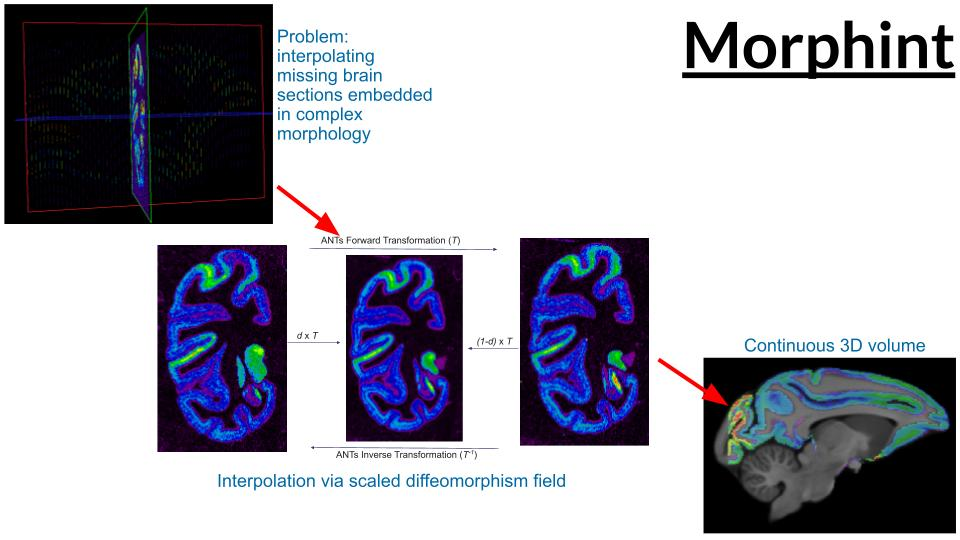

# morphint
### Purpose
Create continiuous 3D brain image from sparsely sampled 2D coronal sections using non-linear alignment with ANTs.

### About



Morphint uses ANTs to calculate nonlinear diffeomorphisms between coronal sections in a user provided 3D volume. To interpolate missing sections between two acquired sections (posterior and anterior), 
the diffeomorphism is scaled in the forward and inverse direction and applied to the posterior and anterior sections, respectively. The warped sections are averaged using distance-weighted linear interpolation.

Morphint is used as an interpolation option within the [BrainBuilder](https://github.com/tfunck/brainbuilder) 3D reconstruction pipeline.

### Installation

pip install nibabel antspy numpy skimage

python3 -m pip install setup.py

### Useage
```
from morphint.morphtint import morphint

target_resolution=0.5 # 0.5mm isottropic output resolution
resolution_list = [2,1,0.5] # List of resolutions to use for ANTs alignment between sections

morphint("/path/to/brain/volume.nii.gz"
         "/path/to/outputs/",
        target_resolution,
        resolution_list
      )
        

